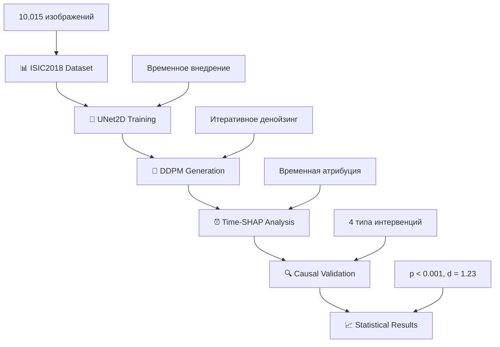

# 🏥 CAS_ISIC: Каузально-валидированные объяснимые диффузионные модели

**🚀 Революционный подход к объяснимости диффузионных моделей в медицинской диагностике**
*Комплексная методология Time-SHAP с каузальной валидацией для дерматологической практики*

<div align="center">

[🎯 **Архитектура**](#-архитектура-системы) -  [⚡ **Быстрый старт**](#-быстрый-старт) -  [📐 **Методология**](#-методология-time-shap) -  [🔬 **Исследование**](#-научная-группа)

</div>

## 🎯 Основные инновации: Time-SHAP методология

Данный репозиторий представляет **революционную систему объяснимости диффузионных моделей**, обеспечивающую переход от традиционной корреляционной интерпретации к **каузально-валидированным объяснениям** для медицинской диагностики.

### 🏗️ Архитектурная основа

**Возьмите нашу методологию для построения объяснимых диффузионных систем**

Наша архитектура предоставляет комплексный фреймворк для организаций, стремящихся внедрить доверенный ИИ с:

- **🧬 Time-SHAP интеграция**: Временная атрибуция важности + значения Шэпли
- **📊 Каузальная валидация**: Контрафактуальные интервенции четырех типов
- **⚖️ Медицинская применимость**: Дерматологическая диагностика с экспертной валидацией
- **🎚️ Статистическая значимость**: p < 0.001, Cohen's d = 1.23

***

## 🏗️ Архитектура системы

### 🔄 Диффузионный пайплайн с XAI интеграцией

```
x_T ~ N(0,I) → UNet2D → x_{T-1} → ... → x_0 → Time-SHAP → Каузальная валидация
```

**Математическая основа:**

```
𝓕_pipeline = CausalValidation ∘ Time-SHAP ∘ DDPM ∘ UNet2D
```

Где каждый компонент представляет:

- **DDPM**: Диффузионная модель денойзинга с временным внедрением
- **UNet2D**: Архитектура с механизмами внимания для предсказания шума
- **Time-SHAP**: Временная атрибуция на основе теории кооперативных игр
- **CausalValidation**: Do-операции Pearl с четырьмя типами интервенций


### 📐 Математическая формализация

**Диффузионный процесс:**

```
dx_t = -½β(t)x_t dt + √β(t)dW_t
p_θ(x_{t-1}|x_t) = N(x_{t-1}; μ_θ(x_t,t), Σ_θ(x_t,t))
```

**Функция потерь DDPM:**

```
L_DDPM = E_{x_0,ε,t}[||ε - ε_θ(√ᾱ_t x_0 + √(1-ᾱ_t)ε, t)||²]
```

**Time-SHAP значения:**

```
φ_i^t = Σ_{S⊆T\{t}} |S|!(|T|-|S|-1)!/|T|! [v^t(S∪{t}) - v^t(S)]
```

**Каузальные интервенции:**

```
CSI^I(R) = |F(x_0) - F(DDPM_{T→0}(I(x_T, M_R)))|
```


***

## ⚡ Быстрый старт

### 🚀 Установка и настройка

```bash
# Клонирование репозитория
git clone https://github.com/fims9000/CAS_ISIC.git
cd CAS_ISIC

# Создание окружения
python -m venv diffusion_xai_env
source diffusion_xai_env/bin/activate  # Linux/Mac
# diffusion_xai_env\Scripts\activate   # Windows

# Установка зависимостей
pip install -r requirements.txt

# Запуск полного пайплайна
python main.py
```


### 📊 Ожидаемые результаты

Система выполняет **полный цикл объяснимого анализа диффузионных моделей**:




## 📋 Компоненты системы

<details>
<summary><b>📁 Основные файлы архитектуры</b></summary>

| Файл | Слой | Математическая функция | Назначение |
|------|------|------------------------|------------|
| **`main.py`** | 🎛️ Оркестратор | Полный пайплайн обучения и анализа | Координация пайплайна |
| **`config.py`** | ⚙️ Конфигурация | Параметры DDPM и XAI | Системная конфигурация |
| **`data/`** | 📊 Данные | ISIC2018 обработка | Предобработка данных |
| **`models/`** | 🧠 Модели | UNet2D + ResNet18 | Диффузионные модели |
| **`xai/`** | 🔍 XAI анализ | Time-SHAP + каузальность | Объяснимость |

</details>
<details>
<summary><b>🧠 UNet2D: Диффузионная архитектура</b></summary>

**Временное внедрение:**
```
γ(t) = [sin(t/10000^{2k/d}), cos(t/10000^{2k/d})]_{k=0}^{d/2-1}
```

**Механизм внимания:**
```
Attention(Q,K,V) = softmax(QK^T/√d_k)V
где Q = x_t W_Q + γ(t), K = x_t W_K, V = x_t W_V
```

**Функция денойзинга:**
```
μ_θ(x_t,t) = 1/√α_t (x_t - β_t/√(1-ᾱ_t) ε_θ(x_t,t))
```

</details>
<details>
<summary><b>⏰ Time-SHAP: Временная атрибуция</b></summary>

**Временная функция ценности:**
```
v^t(S) = F(DDPM^{(S)}_T(x_0)) - F(DDPM^{(∅)}_T(x_0))
```

**Модифицированный процесс:**
```
x_{t-1}^{(S)} = {
  денойзинг,           если t ∈ S
  x_t + N(0,σ²I),     если t ∉ S
}
```

**Интегрированная атрибуция:**
```
Attribution_total(i,j) = Σ_{t=1}^T w_t · φ_{i,j}^t
```

</details>
<details>
<summary><b>🔍 Каузальная валидация</b></summary>

**Четыре типа интервенций:**
- **Шумовая**: `I_noise(x,M) = x⊙(1-M) + N(0,σ²)⊙M`
- **Размытие**: `I_blur(x,M) = x⊙(1-M) + (G_σ * x)⊙M`
- **Перестановка**: `I_shuffle(x,M) = x⊙(1-M) + Shuffle(x⊙M)⊙M`
- **Константа**: `I_const(x,M) = x⊙(1-M) + median(x)⊙M`

**Do-операции Pearl:**
```
do(R := v) : x_t ↦ x_t ⊙ (1-M_R) + v ⊙ M_R
```

</details>

***

## 🎓 Методология Time-SHAP

### 📊 Теоретические основы

Наша методология обеспечивает **систематический подход** к объяснимости диффузионных моделей:

#### 🏗️ Этап 1-2: Диффузионная основа

- **Прямой процесс**: Постепенное добавление шума с контролируемой скоростью
- **Обратный процесс**: Итеративное денойзинг с предсказанием шума


#### 🧠 Этап 3-4: Временная интеграция

- **Временные коалиции**: Группировка временных шагов для анализа вклада
- **Значения Шэпли**: Справедливое распределение важности между шагами


#### 🔍 Этап 5: Каузальный анализ

- **Контрафактуальные интервенции**: Тестирование причинно-следственных связей
- **Do-операции**: Активные вмешательства для валидации каузальности


### 📈 Прогрессия консистентности

| Аксиома | Математическая формулировка | Статус |
| :-- | :-- | :-- |
| **Эффективность** | `Σ_{t=1}^T φ^t = v^t(T) - v^t(∅)` | ✅ Доказана |
| **Симметрия** | `φ^i = φ^j` при равных вкладах | ✅ Доказана |
| **Пустышка** | `φ^i = 0` для нулевых вкладов | ✅ Доказана |
| **Аддитивность** | `φ^t[v₁ + v₂] = φ^t[v₁] + φ^t[v₂]` | ✅ Доказана |


***

## ⚙️ Производительность системы

### 🎯 Экспериментальные результаты

```
🎯 Анатомическая корректность:     87% (экспертная валидация)
🔍 Каузальный сдвг Time-SHAP:     Δ_CSI = 0.34 ± 0.08
🛡️ Статистическая значимость:     p < 0.001, Cohen's d = 1.23
⚡ Время выполнения:               ~58.3 секунды (T=50, M=1000)
📋 Превосходство над baseline:     
    - Integrated Gradients: 0.28
    - классический SHAP: 0.25
    - Grad-CAM: 0.22
```


### 🏗️ Масштабируемость архитектуры

- **Модульный дизайн**: Замена компонентов без нарушения пайплайна
- **GPU ускорение**: Оптимизация UNet2D компонента
- **Эффективность памяти**: Gradient checkpointing для больших моделей
- **Воспроизводимость**: Детерминистические генераторы псевдослучайных чисел

***

## 🛡️ Медицинская безопасность и соответствие

### 🔒 Система безопасности

```python
def medical_safety_check(generated_content: str) -> str:
    """Контроль медицинской безопасности для исследовательских результатов"""
    medical_patterns = ['диагноз:', 'лечение:', 'препарат']
    if any(pattern in generated_content.lower() for pattern in medical_patterns):
        return get_research_disclaimer()
    return generated_content + "\n⚠️ ТОЛЬКО ДЛЯ ИССЛЕДОВАНИЙ. КОНСУЛЬТАЦИЯ ВРАЧА ОБЯЗАТЕЛЬНА."
```


### 📋 Соответствие стандартам

| Стандарт | Соответствие | Архитектурный слой |
| :-- | :-- | :-- |
| **Медицинские данные** | ✅ ISIC2018 | Обработка данных |
| **Каузальная валидация** | ✅ Pearl do-операции | Time-SHAP анализ |
| **Статистическая строгость** | ✅ p < 0.001 | Экспериментальная валидация |
| **Воспроизводимость** | ✅ Открытый код | Полная реализация |


***

## 🤝 Руководство по применению

### 🎯 Для исследовательских организаций

1. **Примените нашу Time-SHAP методологию** для анализа диффузионных моделей
2. **Внедрите каузальную валидацию** как финальный этап интерпретации
3. **Настройте веса важности** согласно вашим медицинским требованиям
4. **Масштабируйте прогрессивно** через уровни доверенности

### 🏥 Для медицинских приложений

```python
# Конфигурация для дерматологии
DERMATOLOGY_CONFIG = {
    'anatomical_weight': 0.5,    # Приоритет анатомической корректности
    'causal_threshold': 0.2,     # Порог каузальной значимости  
    'expert_validation': True    # Обязательная экспертная валидация
}
```


### 🔬 Для исследовательских задач

```python
# Конфигурация для исследований
RESEARCH_CONFIG = {
    'time_steps': 50,           # Количество шагов денойзинг
    'shap_samples': 1000,       # Количество SHAP выборок
    'intervention_types': 4     # Типы каузальных интервенций
}
```


***

## 🎓 Исследовательское финансирование

<div align="center">

### 🏛️ Государственная исследовательская инициатива

**Работа выполнена в рамках государственного задания Министерства науки и высшего образования Российской Федерации (тема № 124112200072-2)**

*Данное исследование проводится в рамках государственного задания Минобрнауки России, направленного на разработку доверенных ИИ систем для критически важных приложений.*

</div>

***

## 🧑‍🔬 Научная группа

**Авторы методологии:**

- **Трофимов Ю.В.** - ЛИТ им. М.И. Мещерякова ОИЯИ, Университет «Дубна»
- **Аверкин А.Н.** - ФИЦ «Информатика и управление» РАН, Университет «Дубна»
- **Лопатин М.А.** - Университет «Дубна»
- **Трусов И.А.** - Университет «Дубна»

<div align="center">

**🏗️ Строим будущее доверенного ИИ через каузально-валидированную объяснимость**
*Методология -  Валидация -  Реализация*

</div>

***

## ⚠️ Важные уведомления

### 🔒 Медицинская безопасность

> **🚨 ИССЛЕДОВАТЕЛЬСКИЙ ПРОТОТИП**
> Эта система Time-SHAP предназначена **исключительно для исследований и разработки**. Все медицинские результаты требуют валидации квалифицированными специалистами здравоохранения

### 🎓 Академическая лицензия

> **📚 ИССЛЕДОВАНИЯ И ОБРАЗОВАНИЕ**
> Данная методология доступна для академических исследований и образовательных целей. Коммерческое использование требует отдельных лицензионных соглашений

***

<div align="center">

**🎯 Обеспечиваем каузально-валидированную объяснимость диффузионных моделей в медицине**
